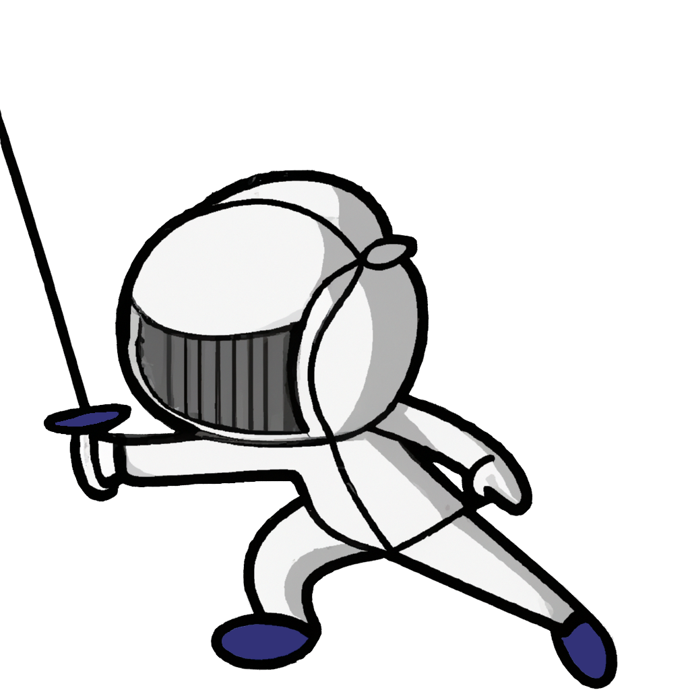

    
    <h1>
        Know Your Parries
    </h1>
    

        A small website to practice/learn your fencing parries.
    

    

## Description

Know Your Parries (KYP) is a web-based application designed for fencers aiming to enhance their parry techniques. The app offers an enjoyable way to practice and refine fencing skills by randomly assigning a parry (1-9). It incorporates audio cues for parry identification, a timer for session tracking, and visual representations of each parry.

## Features

-   Random parry selection
-   Audio guidance
-   Timer for practice sessions
-   Start and stop options
-   Visual representation of parries

## Getting Started

Visit the KYP [website](https://kyptk.netlify.app/) and click "Start Practice." The app will randomly select a parry, play audio guidance, and display a visual representation. A 3-minute timer begins, with 2 seconds per parry for identification and execution. Stop the session anytime by clicking "Stop Practice." Ready to enhance your fencing skills?S

## Contributing

Contributions are welcome! If you'd like to contribute to KYP, please fork the repository and make your changes. Once you're ready, submit a pull request and I'll review your changes.

## License

This project is licensed under the MIT License.

## Reference(s)

-   [Parry (fencing)](<https://en.wikipedia.org/wiki/Parry_(fencing)>)
